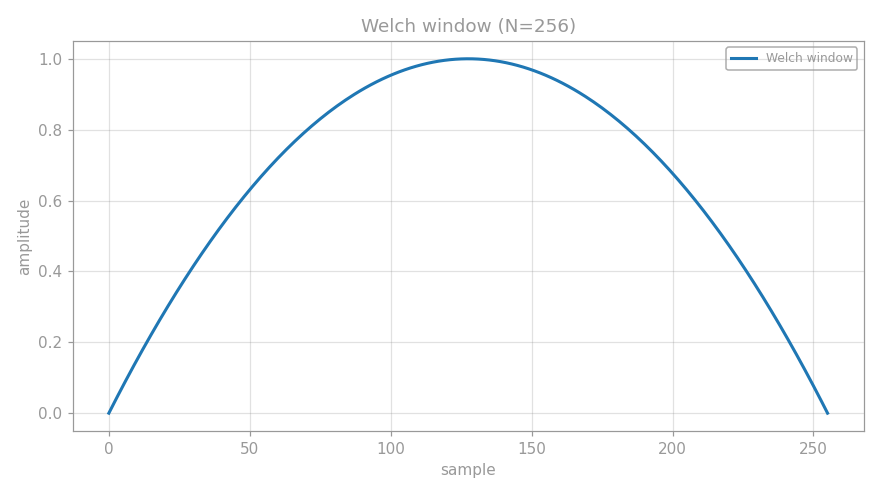
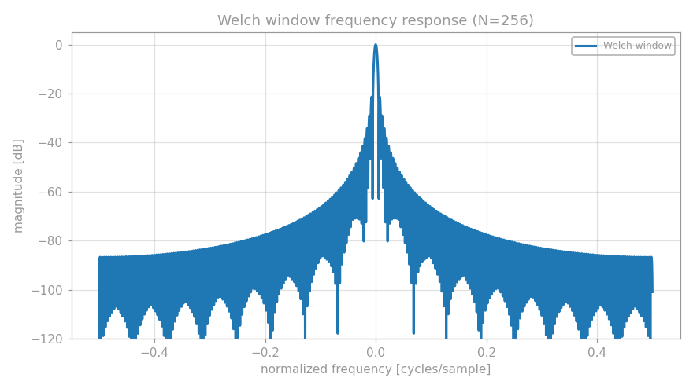
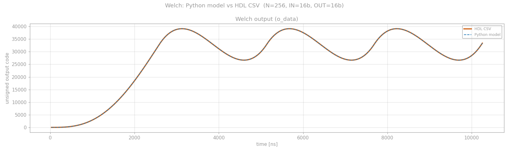

# Welch Window FIR Filter

This project implements a parametrizable fixed-point **Welch window** as a
sample-by-sample FIR weighting stage. It is one member of a larger family of
FIR filters; this document covers only the Welch implementation.


## Contents

```text
.
├── Img/
│   ├── welch_time.png       # Welch window in the time domain
│   ├── welch_frequency.png  # Window frequency response
│   └── welch_compare.png    # Python model compared with HDL output
├── python/
│   ├── welch.py             # Generates the explanatory plots
│   └── welch_model.py       # Bit-exact model and CSV comparison
├── results/
│   └── tb_Welch.csv         # Reference testbench output
├── rtl/
│   ├── Welch.v              # Verilog implementation
│   └── Welch.vhd            # VHDL implementation
├── tb/
│   ├── tb_Welch.v           # Verilog testbench
│   └── tb_Welch.vhd         # VHDL testbench
└── Welch.md
```

## Theory

Windowing multiplies each input sample by a coefficient that varies across a
frame. The Welch window used by the RTL is

$$
w[n] = 1 - x[n]^2,
\qquad x[n] = \frac{2n}{N} - 1,
\qquad 0 \leq n < N.
$$

It is zero at the beginning of the frame, reaches one around its midpoint, and
returns close to zero at the end. `WINDOW_LEN` must be a power of two so that
the coordinate scaling can be implemented with a shift. The sample counter
wraps naturally after `N` samples, creating a repeated window frame.

The RTL computes the coefficient as `2*x - x^2`, then multiplies it by the
unsigned input sample:

```text
coefficient = 2*x - x^2
product     = coefficient * i_data
```

The plot script uses the common symmetric plotting form with `(N - 1)` in the
normalization denominator. That makes the endpoints visually reach zero; the
bit-exact RTL behavior is defined by `Welch.v` and `welch_model.py`.

### Fixed-point precision

With `P = PRECISION` fractional bits, a real value is stored as
`round(value * 2^P)`. The coefficient value `1.0` is therefore represented by
`2^P`, requiring `P + 1` unsigned coefficient bits.

The implementation uses the conservative rule

$$
P = \max\left(\texttt{OUTPUT\_SIZE}+1,\;\log_2(N)-1\right).
$$

The first term keeps coefficient quantization below the requested output
resolution. The second preserves the power-of-two coordinate steps. Input
width does not determine `P`: it scales both the multiplication error and the
available output range.

For example, with `N = 256` and `OUTPUT_SIZE = 16`,
`PRECISION = max(17, 7) = 17`, and `COEFF_WIDTH = 18`.

## Interface

### Parameters

| Name | Default | Description |
|---|---:|---|
| `INPUT_SIZE` | `16` | Unsigned input width in bits. |
| `WINDOW_LEN` | `64` | Number of samples per frame. Must be at least 2 and a power of two. |
| `OUTPUT_SIZE` | `16` | Unsigned output width. Must not exceed `INPUT_SIZE`. |

The internal widths are derived from these parameters:
`PRECISION` stores coefficient fractional bits, `COEFF_WIDTH` stores the
coefficient including the range bit, and `PRODUCT_WIDTH` covers the input and
coefficient multiplication.

### Ports

| Name | Direction | Description |
|---|---|---|
| `i_clk` | input | Rising-edge clock. |
| `i_rst_n` | input | Asynchronous active-low reset. |
| `i_data` | input | Unsigned input sample. |
| `i_valid` | input | Advances the counter and updates the output when high. |
| `o_data` | output | Registered windowed sample. Holds its value when `i_valid` is low. |
| `o_valid` | output | Registered copy of `i_valid`. |

The output is registered, so the valid flag identifies the cycle in which the
corresponding `o_data` value is available. Reset clears the counter, output,
and valid flag.

## Simulation and comparison

`tb/tb_Welch.v` drives a deterministic unsigned ramp:

```text
i_data = (sample_index * 257) modulo 2^INPUT_SIZE
```

It runs for four complete window frames, writes `tb_Welch.csv`, and records one
extra idle cycle to verify that `o_valid` deasserts while `o_data` is retained.

The Python model repeats the same stimulus and every finite-width operation in
the RTL. A successful comparison reports `BIT-EXACT MATCH`. The model also
creates `welch_compare.png` from the HDL and Python output traces.

The HDL simulator and Python environment are toolchain-dependent. The
testbench can be compiled with a Verilog simulator such as Icarus Verilog;
run `python/welch_model.py` after placing the generated CSV where its
`CSV_PATH` points. The planned VHDL files should use the same parameters,
stimulus, CSV format, and expected results.

## Images







## Reference

- [Window function - Wikipedia](https://en.wikipedia.org/wiki/Window_function)

This project was developed with AI assistance.
